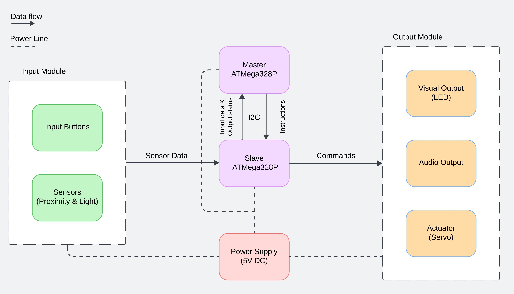

# **Interactive Mini-Robot Companion / Pet**
## A Tamagotchi / Furby-inspired Arduino Project  

This project is a mini-robot "companion" designed to simulate the care and interaction experience of a classic virtual pet. Users can interact with the robot by satisfying its needs, playing minigames, and enjoying its quirky behaviors.

> [!CAUTION]
> This README is a work in progress. Updates will be made as the project develops.

## **Introduction**

### **Initial Idea and Inspiration**  
The inspiration for this project came from the popularity of electronic toys like the Tamagotchi (especially in the late '90s) and Furby (popular in the early 2000s).  

### **Usefulness**  
Designing this robot develops practical skills in both hardware (wiring, circuit design, sensor integration) and software engineering (C programming, modular coding, logic implementation). The project is also a fun, creative challenge and can serve as an educational toy for children.

## **Overview**

### **Features**
- **Basic Needs System**:
  - Tracks hunger, happiness, and energy levels.
  - Needs decrease over time and require user interaction.  
- **Minigames**:
  - Reaction-based minigame.
  - Simple "guess the number" game.  
- **Expressive Outputs**:
  - OLED screen displays emotions and statuses.
  - RGB LED changes color to reflect mood.
  - Buzzer for sound effects and alerts.  
- **Interactive Controls**:
  - Buttons for feeding, playing, and interacting.
  - Gyroscope for position detection.
  - Proximity sensor for enhanced interaction.

### **Block Diagram**  

## **Hardware Design**

### **Bill of Materials (BoM)**  
| Component           | Quantity | Description                               |
|---------------------|:--------:|-------------------------------------------|
| Arduino Uno         |    2     | 2 Microcontrollers (Master and Slave)     |
| Push Buttons        |   3-5    | For user interactions                     |
| OLED Display        |    1     | Displays emotions and information         |
| RGB LED             |    1     | Indicates mood through colors             |
| Piezo Buzzer        |    1     | Produces sound effects                    |
| Resistors (various) |    TBD   | For LEDs and button pull-downs            |
| Breadboard & Wires  |    1 set | For circuit assembly                      |
| Battery Pack (5V)   |    1     | Powers the robot                          |
| Servo Motor         |   1-2    | For movable parts (e.g., hands, ears)     |
| Termometer          |    1     | For temperature measurement               |
| Proximity Sensor    |    1     | TBD                                       |

## **Software Design**  
- **IDE**: PlatformIO (Visual Studio Code extension)  
- **Libraries**:  
  (*TBD*)  
- **Planned Functionality**:  
  - Manage user input from buttons and sensors.
  - Control OLED and RGB outputs for feedback.
  - Execute game logic and manage the needs system.  
  - Modular design for scalability and debugging.

## **Setup**  
(*TBD*)

## **References and Resources**  
### **Software Resources**  
- PlatformIO: [https://platformio.org](https://platformio.org)

### **Hardware Resources**  
- Arduino Uno Datasheet: [https://www.arduino.cc/en/main/arduinoBoardUno](https://www.arduino.cc/en/main/arduinoBoardUno)

## License
This project is licensed under the [MIT License](LICENSE).  
Feel free to use, modify, and distribute this project as long as you include proper attribution.

