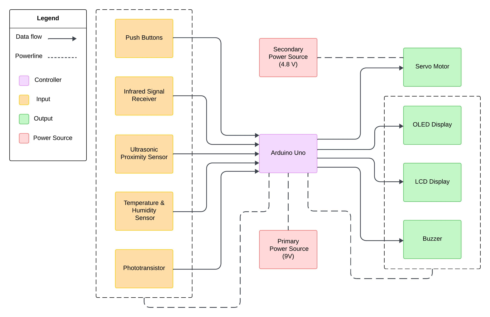

# **Robomagotchi**
## A Tamagotchi / Furby-Inspired Arduino Project  

This project is a mini-robot companion designed to simulate the experience of caring for and interacting with a virtual pet. Users can engage with the robot by satisfying its needs, playing minigames, and interacting through various sensors, buttons, and outputs. The robot responds dynamically to user input and its environment.

> [!CAUTION]
> This README is a work in progress. Updates will be made as the project develops.

> **Table of Contents**
> 1. [Introduction](#introduction)  
> 2. [Overview](#overview)  
> 3. [Hardware Design](#hardware-design)  
> 4. [Software Design](#software-design)  
> 5. [Setup Instructions](#setup)  
> 6. [License Information](#license)  

## **Introduction**

### **Initial Idea and Inspiration**  
The inspiration for this project came from the nostalgic electronic toys like Tamagotchi and Furby. These devices entertained users by simulating the care of a virtual pet. The goal was to blend this concept with modern technology and sensors to create an interactive mini-robot that is not only fun but also educational, showcasing hardware and software integration.  

### **Purpose and Usefulness**  
- **Skill Development**: The project aids in learning embedded systems, sensor integration, and modular software development.  
- **Entertainment**: It provides users with a fun, interactive experience of caring for a virtual pet.  
- **Educational Value**: Useful for teaching kids or beginners about electronics, programming, and robotics concepts.  

## **Overview**

### **Features**  
- **Basic Needs System**:  
  - Tracks virtual hunger, happiness, and energy levels.  
  - Needs decrease over time, prompting user interaction to keep the robot happy.  
- **Minigames**:  
  - *(TBD)*
- **Expressive Outputs**:  
  - OLED screen displays emotions and statuses.  
  - LCD display for additional feedback and minigame visuals.  
  - Buzzer generates alerts and sound effects for user feedback.
  - The servo motor functions as the robot's "antenna", moving in response to specific interactions or reactions.
- **Interactive Controls**:  
  - Buttons allow feeding, playing, and other interactions.  
  - Proximity sensor detects when a user is nearby.  
  - IR receiver enables control via a remote.  
  - Temperature and humidity sensor ensures the robot "lives" in a comfortable environment.  
- **Dynamic Input Sensors**:  
  - Light detection using a phototransistor for additional interactivity. 

### **Block Diagram**  
  

## **Hardware Design**

### **Bill of Materials (BoM)**  

| Component                      | Quantity | Description                                     |
|--------------------------------|:--------:|------------------------------------------------|
| Arduino Uno R3                 |    1     | Microcontroller for controlling the system.     |
| Push Buttons                   |    5     | Buttons for user interaction.                   |
| Servo Motor                    |    1     | For mechanical reaction.                        |
| ST7735 SPI LCD Display         |    1     | Color LCD display for visual output.            |
| GM009605 I2C OLED Display      |    1     | Monochrome OLED display for status/moods.       |
| VS188388 IR Receiver           |    1     | Infrared sensor for remote input.               |
| HC-SR04 Proximity Sensor       |    1     | Detects user proximity for interaction.         |
| DHT11 Temp and Humidity Sensor |    1     | Measures temperature and humidity.              |
| Buzzer                         |    1     | Generates sound alerts and effects.             |
| Resistors (various)            |    6     | For limiting current and voltage division.      |
| Capacitor (100 µF)             |    1     | For noise reduction and voltage stabilization.  |
| AA Battery Holder (4 slots)    |    1     | Holds 4 AA batteries for power.                 |
| AA Batteries  (1.2V each)      |    4     | Provide 4.8V total power for the servo.         |
| 9V Battery                     |    1     | Provides power for the Arduino Uno.             |
| 9V Battery connector           |    1     | Permits battery connection using pins |
| Phototransistor                |    1     | Light-sensitive transistor for light detection. |
| Wires and Breadboard           |    1 set | For circuit assembly and prototyping.           |

### **Circuit Schematic**   
  

*Refer to the [/schematics/files](./schematics/files) folder for the full KiCAD project file.*  

## **Software Design**  

- **IDE**: PlatformIO (Visual Studio Code Extension)  
- **Libraries**:  
  - *(TBD)*
- **Key Functionalities**:  
  1. Manage user inputs (buttons, sensors, IR remote).  
  2. Control outputs (OLED, LCD, buzzer, servo).  
  3. Implement logic for virtual pet needs and decay rates.  
  4. Minigame execution and feedback mechanisms.  
  5. Modular code design for future scalability and debugging.  

## **Setup Instructions**  
### **Hardware Setup**
1. Connect the microcontroller and the components using the following table:

| **Component**      | **Pin Name** | **Connected to**  |
|--------------------|--------------|-------------------|
|**Servo Motor**     |PWM           |5                  |
|                    |+             |4.8V               |
|                    |-             |GND                |
|**LCD Display**     |GND           |GND                |
|                    |VCC           |3.3V               |
|                    |SCL           |Pin 13             |
|                    |SDA           |Pin 11             |
|                    |RES           |Pin 8              |
|                    |DC            |Pin 7              |
|                    |CS            |Pin 4              |
|                    |BLK           |Pin 10             |
|**OLED Display**    |GND           |GND                |
|                    |VDD           |3.3V               |
|                    |SCK           |Pin A4             |
|                    |SDA           |Pin A5             |
|**IR Receiver**     |SIG           |Pin 9              |
|                    |GND           |GND                |
|                    |VCC           |3.3V               |
|**Proximity Sensor**|VCC           |5V                 |
|                    |TRIG          |Pin A2             |
|                    |ECHO          |Pin 12             |
|                    |GND           |GND                |
|**Temp Sensor**     |Vs            |3.3V               |
|                    |Vout          |Pin A3             |
|                    |GND           |GND                |
|**Buzzer**          |+             |Pin 6 through Rb   |
|                    |-             |GND                |
|**Phototransistor** |+             |3.3V               |
|                    |-             |Pin A0             |

  - Connect the 100μF capacitor between the servo motor's + and - pins.   
  - Connect the resistor and pushbutton ladder to 3.3 volts on one side and GND on the other side. Connect Pin 2 between R4 and R5. R5 will act as a pull-down resistor.

2. Connect the negative pins of the 4.8V and 9V power sources to the same ground as the Arduino board. 
3. Connect the + pin of the 9V battery connector to the **VIN** pin on the Arduino board.

### **Software setup**
*(TBD)*

## **References and Resources**  

### **Software Resources**  
- [PlatformIO](https://platformio.org)  

### **Hardware Resources**  
- [Arduino Uno Datasheet](https://www.arduino.cc/en/main/arduinoBoardUno)   

## **License**  
This project is licensed under the [MIT License](LICENSE).  
Feel free to use, modify, and distribute this project as long as proper attribution is provided.  
