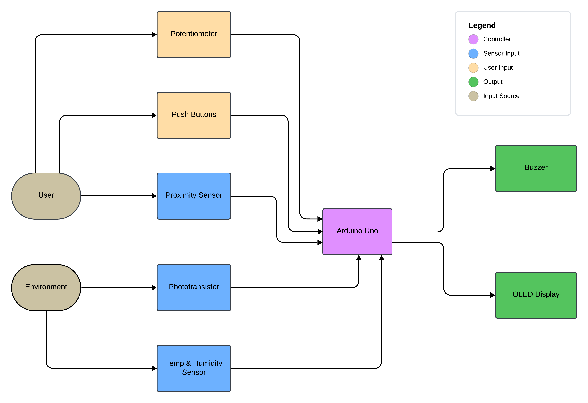

# **Robomagotchi**
## A Tamagotchi / Furby-Inspired Arduino Project  

This project is a mini-robot companion designed to simulate the experience of caring for and interacting with a virtual pet. Users can engage with the robot by satisfying its needs, playing minigames, and interacting through various sensors, buttons, and outputs. The robot responds dynamically to user input and its environment.

## **Table of Contents**
1. [Introduction](#introduction)  
2. [Overview](#overview)  
3. [Hardware Design](#hardware-design)  
4. [Software Design](#software-design)  
5. [Setup Instructions](#setup-instructions)  
6. [Demo](#demo)
7. [References and Resources](#references-and-resources)  
8. [License Information](#license)  

## **Introduction**

### **Initial Idea and Inspiration**  
The inspiration for this project came from the nostalgic electronic toys like Tamagotchi and Furby. These devices entertained users by simulating the care of a virtual pet. The goal was to blend this concept with modern technology and sensors to create an interactive mini-robot that is not only fun but also educational, showcasing hardware and software integration.  

### **Purpose and Usefulness**  
- **Skill Development**: The project aids in learning embedded systems, sensor integration, and modular software development.  
- **Entertainment**: It provides users with a fun, interactive experience of caring for a virtual pet.  
- **Educational Value**: Useful for teaching kids or beginners about electronics, programming, and robotics concepts.  

## **Overview**

### **Features**  
- **Basic Needs System**:  
  - Tracks virtual energy, joy, maintenance and relaxation levels.  
  - Needs decrease over time, prompting user interaction to keep the robot happy.  
- **Minigame**:  
  - Play the Higher-Lower minigame using a potentiometer in order to guess a randomly generated value.
- **Expressive Outputs**:  
  - OLED screen displays emotions and statuses.    
  - Buzzer generates alerts and sound effects for user feedback.
- **Interactive Controls**:  
  - Buttons allow various interactions.  
  - Proximity sensor detects when a user is nearby.   
  - Temperature and humidity sensor ensures the robot "lives" in a comfortable environment.  
- **Dynamic Input Sensors**:  
  - Light detection using a phototransistor for additional interactivity. 

### **Block Diagram**  
  

## **Hardware Design**

### **Bill of Materials (BoM)**  

| Component | Model / Value | Quantity | Description | Datasheet |
|-----------|:-------------:|:--------:|-------------|:---------:|
| Arduino Uno R3 | ATmega328P | 1 | Microcontroller board | [Link](https://docs.arduino.cc/resources/datasheets/A000066-datasheet.pdf) |
| Wires and Breadboard| - | 1 set | For circuit assembly | N/A |
| OLED Display | SSD1306 | 1 | I2C Display for visual output | [Link](https://www.datasheethub.com/wp-content/uploads/2022/08/SSD1306.pdf) |
| Temp & Humidity Sensor | DHT11 | 1 | Measures temperature and humidity | [Link](https://www.mouser.com/datasheet/2/758/DHT11-Technical-Data-Sheet-Translated-Version-1143054.pdf) |
| Buzzer | PKM22EPP-40 | 1 | Generates sound alerts and effects | [Link](https://datasheet4u.com/datasheet-pdf/MurataElectronics/PKM22EPP/pdf.php?id=504237) |
| Proximity Sensor | HC-SR04 | 1 | Ultrasonic proximity sensor for interaction | [Link](https://docs.google.com/document/d/1Y-yZnNhMYy7rwhAgyL_pfa39RsB-x2qR4vP8saG73rE/edit?pli=1&tab=t.0) |
| Phototransistor | - | 1 | Light-sensitive transistor for light detection | N/A |
| Potentiometer | - | 1 | Used for minigame controls | N/A |
| Push Buttons | - | 2 | Buttons for user interaction | N/A |
| Battery | 9V | 1 | Provides power for the Arduino | N/A |
| 9V Battery Connector | - | 1 | Permits battery connection using pins | N/A |
| Resistors | various | 4 | Pull-down resistors for voltage readings | N/A |

### **Circuit Schematic**   
  

*Refer to the [/schematics](./schematics) folder for the full KiCAD project file.*  

## **Software Design**  

- **Overview**:
The Robomagotchi operates as a *Finite State Machine (FSM)*. The system is divided into 6 distinct states, each representing a specific mode of operation. Transitions between these stages are triggered either automatically or by the user. This ensures that the Robomagotchi is modular, predictable, and easier to extend or debug.

- **Key Functionalities**:  
  - Manage user inputs (buttons, sensors).  
  - Control outputs (OLED, buzzer).  
  - Implement logic for virtual pet needs and decay rates.  
  - Minigame execution and feedback mechanisms.  
  - Modular code design for future scalability and debugging.  

## **Setup Instructions**  
### **Hardware Setup**
1. Connect the microcontroller and the components using the following table:

  | Component | Pin Name | Connected To |
  |-----------|----------|--------------|
  | OLED Display | GND | GND |
  | | VDD | 3.3V |
  | | SCK | Pin A5 |
  | | SDA | Pin A4 |
  | Temp Sensor | DATA | Pin 7 |
  | | VDD | 3.3V |
  | | GND | GND |
  | Buzzer | + | Pin 6 |
  | | - | GND through Rb |
  | Proximity Sensor | VCC | 5V |
  | | TRIG | Pin 5 |
  | | ECHO | Pin 4 |
  | | GND | GND |
  | Phototransistor | + | 3.3V |
  | | - | Pin A2, GND through Rq |
  | Potentiometer | VCC | 5V |
  | | OUT | Pin A1 |
  | | GND | GND |

- Connect the buttons as shown in the [schematic](./schematics/kicad_schematic_cropped.png).

2. Connect the **9V battery**: **-** to the common **GND** and **+** to **VIN** on the Arduino board.

### **Software setup**
1. Install Visual Studio Code and the Platformio extension. You can also use Arduino IDE or any other IDE.
2. Install the necessary [libraries](#software-resources).
3. Clone the repository: `git clone https://github.com/Adrifot/Robomagotchi_Arduino_Project.git`

## Demo

## **References and Resources**  

### **Software Resources**  
- **IDE**: PlatformIO (Visual Studio Code Extension)  
- **Libraries**:  
  - [Adafruit GFX Library](https://github.com/adafruit/Adafruit-GFX-Library)
  - [Adafruit SSD1306 Library](https://github.com/adafruit/Adafruit_SSD1306)
  - [Adafruit DHT Library](https://github.com/adafruit/DHT-sensor-library)
  - [Adafruit Unified Sensor Library](https://github.com/adafruit/Adafruit_Sensor)
  - [Wire I2C Library](https://docs.arduino.cc/language-reference/en/functions/communication/wire/)

### **Hardware Resources**  
See the [BoM](#bill-of-materials-bom) for datasheets for each component (if applicable).

## **License**  
This project is licensed under the [MIT License](LICENSE).  
Feel free to use, modify, and distribute this project as long as proper attribution is provided.  
