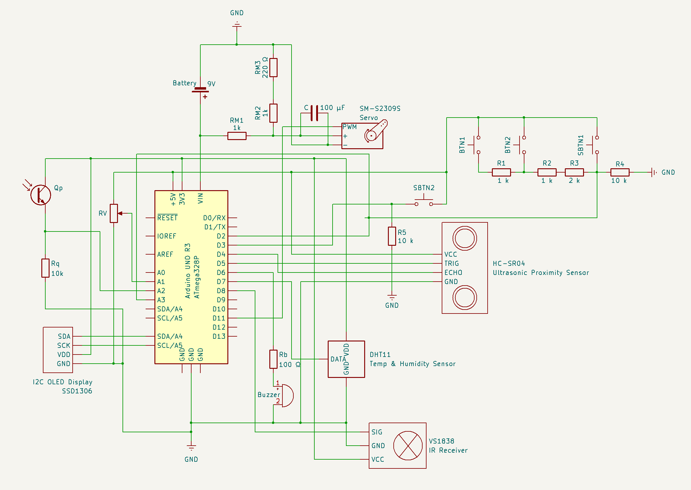

# **Robomagotchi**
## A Tamagotchi / Furby-Inspired Arduino Project  

This project is a mini-robot companion designed to simulate the experience of caring for and interacting with a virtual pet. Users can engage with the robot by satisfying its needs, playing minigames, and interacting through various sensors, buttons, and outputs. The robot responds dynamically to user input and its environment.

> [!CAUTION]
> This README is a work in progress. Updates will be made as the project develops.

## **Table of Contents**
1. [Introduction](#introduction)  
2. [Overview](#overview)  
3. [Hardware Design](#hardware-design)  
4. [Software Design](#software-design)  
5. [Setup Instructions](#setup-instructions)  
6. [References and Resources](#references-and-resources)  
7. [License Information](#license)  

## **Introduction**

### **Initial Idea and Inspiration**  
The inspiration for this project came from the nostalgic electronic toys like Tamagotchi and Furby. These devices entertained users by simulating the care of a virtual pet. The goal was to blend this concept with modern technology and sensors to create an interactive mini-robot that is not only fun but also educational, showcasing hardware and software integration.  

### **Purpose and Usefulness**  
- **Skill Development**: The project aids in learning embedded systems, sensor integration, and modular software development.  
- **Entertainment**: It provides users with a fun, interactive experience of caring for a virtual pet.  
- **Educational Value**: Useful for teaching kids or beginners about electronics, programming, and robotics concepts.  

## **Overview**

### **Features**  
- **Basic Needs System**:  
  - Tracks virtual hunger, happiness, and energy levels.  
  - Needs decrease over time, prompting user interaction to keep the robot happy.  
- **Minigames**:  
  - *(TBD)*
- **Expressive Outputs**:  
  - OLED screen displays emotions and statuses.  
  - LCD display for additional feedback and minigame visuals.  
  - Buzzer generates alerts and sound effects for user feedback.
  - The servo motor functions as the robot's "antenna", moving in response to specific interactions or reactions.
- **Interactive Controls**:  
  - Buttons allow feeding, playing, and other interactions.  
  - Proximity sensor detects when a user is nearby.  
  - IR receiver enables control via a remote.  
  - Temperature and humidity sensor ensures the robot "lives" in a comfortable environment.  
- **Dynamic Input Sensors**:  
  - Light detection using a phototransistor for additional interactivity. 

### **Block Diagram**  
  

## **Hardware Design**

### **Bill of Materials (BoM)**  

| Component | Model / Value | Quantity | Description | Datasheet |
|-----------|:-------------:|:--------:|-------------|:---------:|
| Arduino Uno R3 | ATmega328P | 1 | Microcontroller board | [Link](https://docs.arduino.cc/resources/datasheets/A000066-datasheet.pdf) |
| Wires and Breadboard| - | 1 set | For circuit assembly | N/A |
| OLED Display | SSD1306 | 1 | I2C Display for visual output | [Link](https://www.datasheethub.com/wp-content/uploads/2022/08/SSD1306.pdf) |
| Temp & Humidity Sensor | DHT11 | 1 | Measures temperature and humidity | [Link](https://www.mouser.com/datasheet/2/758/DHT11-Technical-Data-Sheet-Translated-Version-1143054.pdf) |
| Buzzer | PKM22EPP-40 | 1 | Generates sound alerts and effects | [Link](https://datasheet4u.com/datasheet-pdf/MurataElectronics/PKM22EPP/pdf.php?id=504237) |
| IR Reveiver | VS1838 | 1 | Infrared receiver for remote input | [Link](https://eeshop.unl.edu/pdf/VS1838-Infrared-Receiver-datasheet.pdf) |
| Servo Motor | SM-S2309S | 1 | For mechanical reaction | [Link](https://www.rhydolabz.com/documents/22/SM_S2309S.pdf) |
| Proximity Sensor | HC-SR04 | 1 | Ultrasonic proximity sensor for interaction | [Link](https://docs.google.com/document/d/1Y-yZnNhMYy7rwhAgyL_pfa39RsB-x2qR4vP8saG73rE/edit?pli=1&tab=t.0) |
| Phototransistor | - | 1 | Light-sensitive transistor for light detection | N/A |
| Potentiometer | - | 1 | Used for minigame controls | N/A |
| Push Buttons | - | 4 | Buttons for user interaction | N/A |
| Infrared Remote | Any | 1 | Controls the system through the IR Receiver | N/A |
| Battery | 9V | 1 | Provides power for the Arduino | N/A |
| 9V Battery Connector | - | 1 | Permits battery connection using pins | N/A |
| Capacitor | 100 μF | 1 | Voltage stabilization for the servo | N/A |
| Resistors | various | 10 | For limiting current and dividing voltage | N/A |

### **Circuit Schematic**   
  

*Refer to the [/schematics/files](./schematics/files) folder for the full KiCAD project file.*  

## **Software Design**  

- **IDE**: PlatformIO (Visual Studio Code Extension)  
- **Libraries**:  
  - *(TBD)*
- **Key Functionalities**:  
  - Manage user inputs (buttons, sensors, IR remote).  
  - Control outputs (OLED, LCD, buzzer, servo).  
  - Implement logic for virtual pet needs and decay rates.  
  - Minigame execution and feedback mechanisms.  
  - Modular code design for future scalability and debugging.  

## **Setup Instructions**  
### **Hardware Setup**
1. Connect the microcontroller and the components using the following table:

  | Component | Pin Name | Connected To |
  |-----------|----------|--------------|
  | OLED Display | GND | GND |
  | | VDD | 3.3V |
  | | SCK | Pin A5 |
  | | SDA | Pin A4 |
  | Temp Sensor | DATA | Pin 7 |
  | | VDD | 3.3V |
  | | GND | GND |
  | Buzzer | + | Pin 6 through Rb |
  | | - | GND |
  | IR Receiver | SIG | Pin 8 |
  | | GND | GND |
  | | VCC | 3.3V |
  | Servo | PWM | Pin 11 |
  | | + | 9V through RM1 |
  | | - | GND |
  | Proximity Sensor | VCC | 5V |
  | | TRIG | Pin 5 |
  | | ECHO | Pin 4 |
  | | GND | GND |
  | Phototransistor | + | 3.3V |
  | | - | Pin A2, GND through Rq |
  | Potentiometer | VCC | 5V |
  | | OUT | Pin A1 |
  | | GND | GND |

  Other components you need to connect:
  - Connect the **capacitor** between the servo's **+** and **-** pins.
  - Build a **voltage divider** using **RM1, RM2 and RM3** (see schematic). Servo will be conected to its Vout (between RM1 and RM2).
  - Build a **resistor ladder** using **R1, R2, R3 and R4** together with **SBTN1, BTN1 and BTN2** (see schematic). Connect **Pins 2 and A3** between **BTN2 and R3**.
  - Connect **SBTN2** to **5V** on one side and to **GND** (through pull-down resistor **R5**) to the other side. Between **SBTN2** and **R4** connect **Pin 3**.

2. Connect the **9V battery**: **-** to the common **GND** and **+** to the breadboard and from there to **VIN** and the **servo's voltage divider**.

### **Software setup**
*(TBD)*

## **References and Resources**  

### **Software Resources**  
- [PlatformIO](https://platformio.org)  

### **Hardware Resources**  
See the [BoM](#bill-of-materials-bom) for datasheets for each component (if applicable).

## **License**  
This project is licensed under the [MIT License](LICENSE).  
Feel free to use, modify, and distribute this project as long as proper attribution is provided.  
